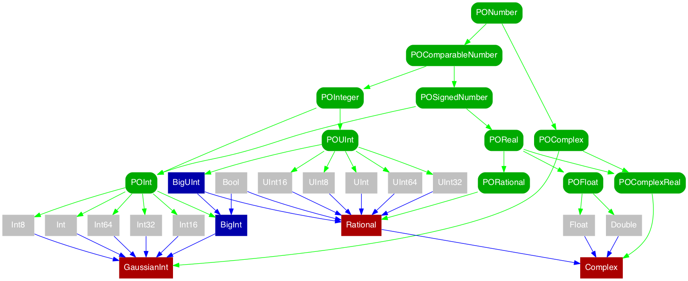

[](http://travis-ci.org/dankogai/swift-pons)

# swift-pons
Protocol-Oriented Number System in Pure Swift



## SYNOPSIS

````swift
import PONS                     // Let the fun begin!
````

Big integer included.  Enjoy unlimited!

````swift
let bn = BigInt(1)<<64 + 1      // 18446744073709551617
bn.asUInt64                     // nil; bn > UIntMax.max
(bn - 2).asUInt64               // 18446744073709551615 == UIntMax.max
bn + bn // 36893488147419103234
bn - bn // 0
bn * bn // 340282366920938463500268095579187314689
bn / bn // 1
````

Rational number also included.
 
````swift
let bq = BigInt(1).over(bn)     // (1/18446744073709551617)
bq + bq // (2/18446744073709551617)
bq - bq // (0/1)
bq * bq // (1/340282366920938463500268095579187314689)
bq / bq // (1/1)
bq.denominator == bn            // true, of course!
bq.reciprocal.numerator == bn   // so is this
````

Complex numbers.  How can we live without them?

````swift
let bz = bq + bq.i  // ((1/18446744073709551617)+(1/18446744073709551617).i)
bz + bz // ((2/18446744073709551617)+(2/18446744073709551617).i)
bz - bz // ((0/1)+(0/1).i)
bz * bz // ((0/1)+(2/340282366920938463500268095579187314689).i)
bz / bz // ((1/1)+(0/1).i)
````

[Elementary function]s (as in `<math.h>`) are supported as static functions. 

`POReal` has defalut implementations so you don't have to implement them for your new number types!

`Darwin` and `Glibc` implementations are attached to `Double` as static functions, too.

[Elementary function]: https://en.wikipedia.org/wiki/Elementary_function

````swift
Double.sqrt(-1)                 // sadly NaN
Rational.sqrt(bq)               // (1/4294967296) == yes, works with Rational, too!
Complex.sqrt(-1)                // (0.0+1.0.i) // as it should be
Complex.log(-1)                 // (0.0+3.14159265358979.i) // Yes, πi
Complex.exp(Double.PI.i)        // (-1.0+1.22464679914735e-16.i) != (-1.0+0.0.i) // :(
// default 64-bit precision is still not good enough…
Complex.exp(BigRat.pi().i)      // (-(1/1)-(1/4722366482869645213696).i)
// but with 128-bit precision…
Complex.exp(BigRat.pi(128).i)   // (-(1/1)+(0/1).i) // as it should be!
````

## USAGE

### With Playground via Workspace

Build the framework before having fun.


To do so, all you need is choose Framework-OSX from the scheme and build it.  With framework done, 
get back to the OSX playground and enjoy.

### With Your Project

0. Just copy pons/*.swift to your project
1. Or build framework and copy it to your project

### With REPL

#### OS X

Simply `make repl` in the top directory.

#### Linux

````
make SWIFTPATH=${YOUR_SWIFT_PATH} repl # ${YOUR_SWIFT_PATH}=~/swift/usr/bin in my case
````

## REQUIREMENT

Swift 2.1 or better.  Linux supported.

With Swift 2.2 you get some deprecation warnings like:

````
pons/pocomplex.swift:13:5: warning: use of 'typealias' to declare associated types is deprecated; use 'associatedtype' instead
    typealias RealType:POSignedNumber
    ^~~~~~~~~
```

Just ignore them for the time being.  They are needed in 2.1.

## FAQ

### Q. Swift already has tons of protocols built-in like [IntegerType] and [FloatingPointType].  Why do you reinvent these?

[IntegerType]: http://swiftdoc.org/v2.1/protocol/IntegerType/
[FloatingPointType]: http://swiftdoc.org/v2.1/protocol/FloatingPointType/
[IntegerArithmeticType]: http://swiftdoc.org/v2.1/protocol/IntegerArithmeticType/
[Comparable]: http://swiftdoc.org/v2.1/protocol/Comparable/
[AbsoluteValuable]: http://swiftdoc.org/v2.1/protocol/AbsoluteValuable/

A.  I wish I could.  As a matter of fact I tried to do so when I started.  It turns out the protocol tree Swift 2.1 offers is not fit for the Protocol-Oriented Number System.  For instance, [FloatingPointType] lacks arithmetic operators.  They can be found in [IntegerArithmeticType] but it includes `%`, something that is not essential for real-number arithmetics

Besides, where are you going to fit `Complex`?  It is the queen of the numbers but definitely not [Comparable].  It is absolute-valuable but Swift says [AbsoluteValuable] is also [Comparable].

I am pretty sure Swift insiders are aware of this issue that should be addressed.  I found the following in the swift-evolution mailing list.

<https://lists.swift.org/pipermail/swift-evolution/Week-of-Mon-20151214/002445.html>
>  I have been working for some time on a rewrite of all the integer types and protocols <https://github.com/apple/swift/blob/master/test/Prototypes/Integers.swift.gyb>.  One goal of this effort is to enable operations on mixed integer types, which as you can see is partially completed.  In-place arithmetic (anInt32 += aUInt64) is next.  Another important goal is to make the integer protocols actually useful for writing generic code, instead of what they are today: implementation artifacts used only for code sharing.  As another litmus test of the usefulness of the resulting protocols, the plan is to implement BigInt in terms of the generic operations defined on integers, and make BigInt itself conform to those protocols. 

Maybe I am a litte too impatient.  But here it is.

> [Impatience]:  The anger you feel when the computer is being lazy. This makes you write programs that don't just react to your needs, but actually anticipate them. Or at least pretend to.

[Impatience]: http://threevirtues.com
